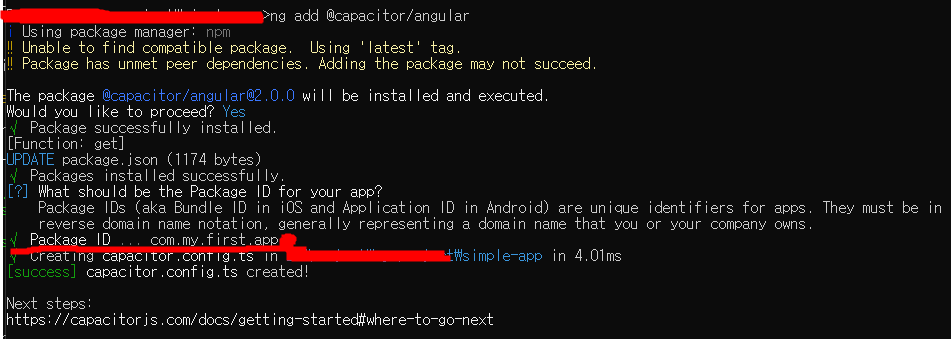
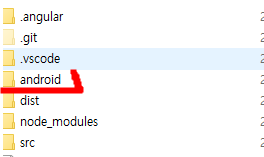
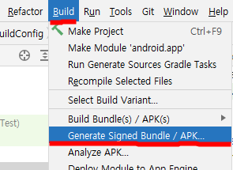
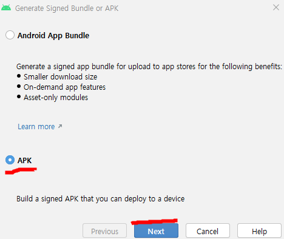
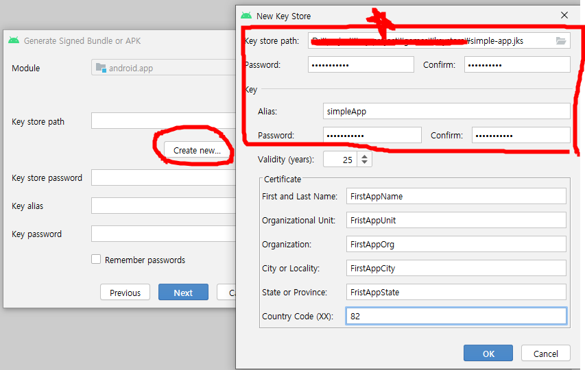
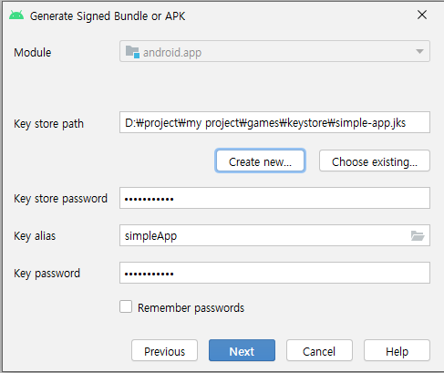
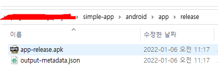

# angular + capacitor를 이용하여 app 앱만들기

Window 환경에서 아주 간단한  Android 앱을 하나 만들어 보겠습니다. \
한시간 안에. \
깊이 들어가지 않고 만드는 전체적인 플로우를 보여드릴 예정입니다.

## 환경설정
Angular, Capacitor, Android Studio를 각각 설치합니다.
[Angular 설치](https://angular.io/guide/setup-local)
[안드로이드 스튜디오 다운로드](https://developer.android.com/studio?gclsrc=ds&gclsrc=ds&gclid=CKDMqsz7m_UCFY9DwgUdJqoLOQ)
[Capacitor 인스톨](https://capacitorjs.com/docs/getting-started)

## angular 프로젝트 생성하기
```
ng new simple-app
```
아래와 같이 인스톨 시간이
```
? Would you like to add Angular routing? Yes
? Which stylesheet format would you like to use? SCSS   [ https://sass-lang.com/documentation/syntax#scss
 ]
CREATE simple-app/angular.json (3231 bytes)
...........................
√ Packages installed successfully.
```
설치된 경로로 이동
```
> cd simple-app
```
아래와 같은 초기 모습이 보이시나요?


브라우저 상에 우리가 만들고자 하는 앱의 모습을 띄워 보이겠습니다.
```
> ng serve --open
```
브라우저(http://localhost:4200/)에서 우리가 만들고자 하는 앱이 보입니다.
여기서는 angular 프로그램에 대해서는 다루지 않을 예정입니다. 단지 현재 보이는 모습을 hybrid앱으로 구현하는 간단한 플로우만 보여 드릴 것입니다.

## Capacitor 추가
아래 문서를 따라 간단하게 처리해 보겠습니다.
[capacitor + angular](https://capacitorjs.com/solution/angular)
simple-app 에서 아래같이 입력합니다.
```
> ng add @capacitor/angular
```
Package ID 에 사용하실 고유 아이디를 입력합니다.


simple-app 디렉토리를 보시면 'capacitor.config.ts' 가 추가되어 있는 것을 확인하실 수 있습니다.
일단 기본적인 모습은 아래와 같습니다.
```
import { CapacitorConfig } from '@capacitor/cli';

const config: CapacitorConfig = {
  appId: 'com.my.first.app',
  appName: 'simple-app',
  webDir: 'dist/simple-app',
  bundledWebRuntime: false
};

export default config;
```
## 빌더앱
현재 앱을 빌더하겠습니다.
```
> ng build --prod
```
빌더가 마무리되면 dist/simple-app (위의 capacitor.config.ts에서 정의한 webDir과 같은 곳) 이란 폴더 하위로 파일들이 생성됩니다.
```
dist/
    └── simple-app
```
## Native Platform 추가
```
> npm i @capacitor/ios @capacitor/android
> npx cap add android
> npx cap add ios
```
일단은 안드로이드 만 할 것이므로 android 만 추가해 보겠습니다.
```
> npm i @capacitor/android
> npx cap add android
```



## 안드로이드 스튜디오
안드로이드 스튜디오를 열겠습니다. 여기서는 안드로이드 스튜디오의 기본 세팅이 마무리되었다는 가정하에서 진행하겠습니다.
```
> npx cap open android
```
위의 명령은 android studio를 오픈하고 webDir에 빌더된 angular 프로젝트를 app > assets > public 폴더로 copy 합니다.
이제 안드로이드 스튜디오에서 배포용 apk를 만들어 보겠습니다.
Build > Generate Signed Bundle / APK...


<!-- 두가지 방식이 있는데 Android App Bundle 을 추천 
### Android App Bundle -->

### APK선택 > Next

Key Store path에서 만약 기존 키가 있으면 불러오시면 되는데 현재 처음 키이므로 새로운 키를 만들겠습니다.
이때 중요한 것은 만들어진 키와 패스워드를 반드시 별도 보관하시기 바랍니다.
이 키가 없으면 업데이트가 불가능합니다.

모든 것이 처리되었으면 Next

그리고 최종적으로 apk 파일이 생성된 것을 확인하실 수 있습니다. 이키를 android play console에서 등록하시면 됩니다. 안드로이드 플레이 콘솔에 대해서는 별도 설명을 추가하겠습니다.


추가로 사용법에 대해서 궁금하시면 [안드로이드 스튜디오 간단한 사용법](android.md)


