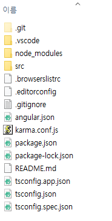
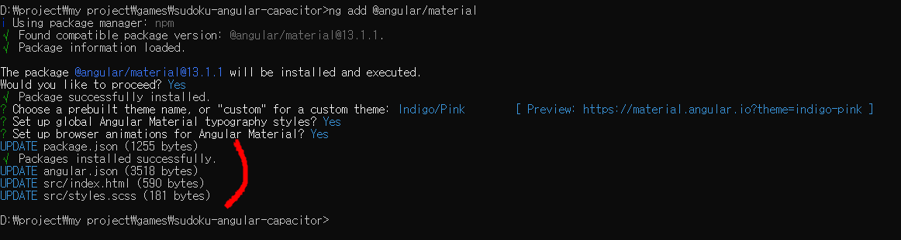

# Angular 기본 세팅
[Angular 설치관련 공식 문서](https://angular.io/guide/setup-local)

## Angular 프로젝트 생성하기
```
ng new simple-app
```
아래와 같이 인스톨 시간이
```
? Would you like to add Angular routing? Yes
? Which stylesheet format would you like to use? SCSS   [ https://sass-lang.com/documentation/syntax#scss
 ]
CREATE simple-app/angular.json (3231 bytes)
...........................
√ Packages installed successfully.
```
설치된 경로로 이동
```
> cd simple-app
```
아래와 같은 초기 모습이 보이시나요?


브라우저 상에 우리가 만들고자 하는 앱의 모습을 띄워 보이겠습니다.
```
> ng serve --open
```
브라우저(http://localhost:4200/)에서 우리가 만들고자 하는 앱이 보입니다.

## Angular Material 세팅
위와 같이 기본 세팅이 되면 다음으로 할 단계는 angular material을 세팅하는 것이다.
angular는 다양한 컴포넌트를 제공함으로 더욱 쉽고 아름답게 화면 구성이 가능하다.

```
ng add @angular/material
```

