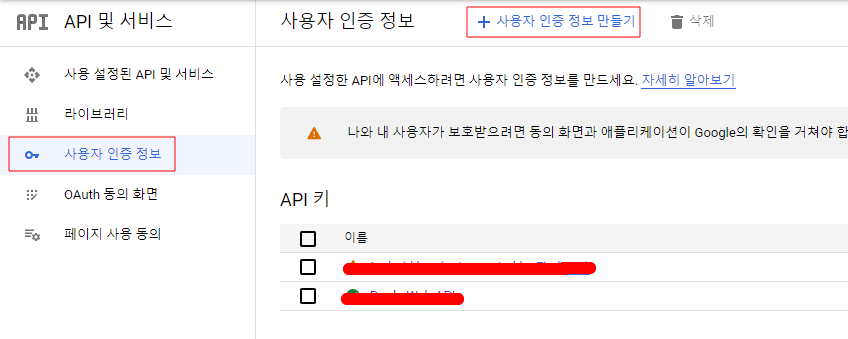
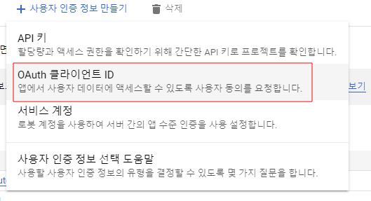
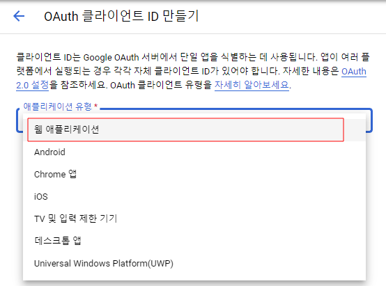
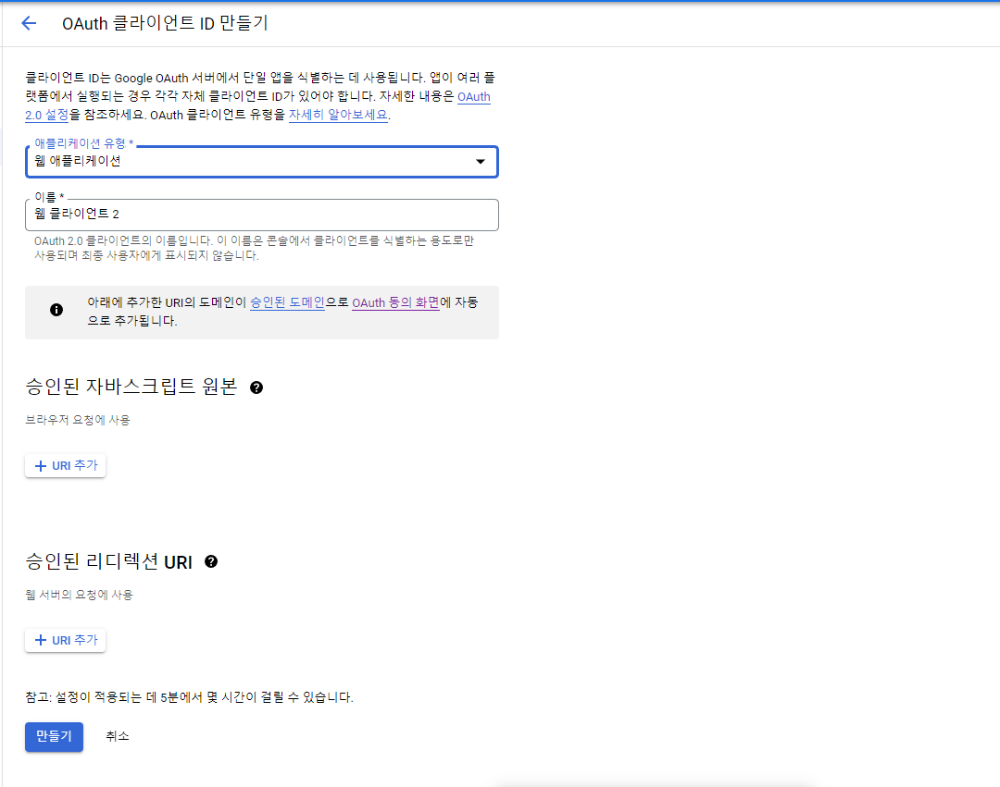
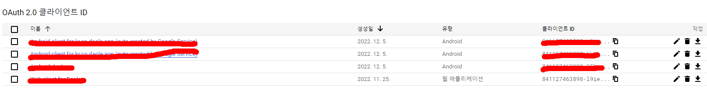

# 구글클라우드플랫폼(GCP)
## 사용자 인증 정보
### OAuth 2.0  클라이언트  ID
- 구글 social login 에 사용

- API 및 서비스 > 사용자 인증 정보 > 사용자 인증 정보 만들기


- API 및 서비스 > 사용자 인증 정보 > 사용자 인증 정보 만들기 > OAuth 클라이언트 ID


- [웹 애플리케이션 선택]


- 필요정보 입력

- 최종정보
    - 여기서 우리는  클라이언트  ID나  클라이언트 비밀번호 혹은 서비스에 필요한 JSON파일을 다운로드 받을 수 있다.


xxx.json 파일에는 아래처럼 다양한 정보가 들어간다.
```
{
	"web":{
		"client_id":"x",
		"project_id":"x",
		"auth_uri":"https://accounts.google.com/o/oauth2/auth",
		"token_uri":"https://oauth2.googleapis.com/token",
		"auth_provider_x509_cert_url":"https://www.googleapis.com/oauth2/v1/certs",
		"client_secret":"x",
		"redirect_uris":[],
		"javascript_origins":[]
	}
}
```
