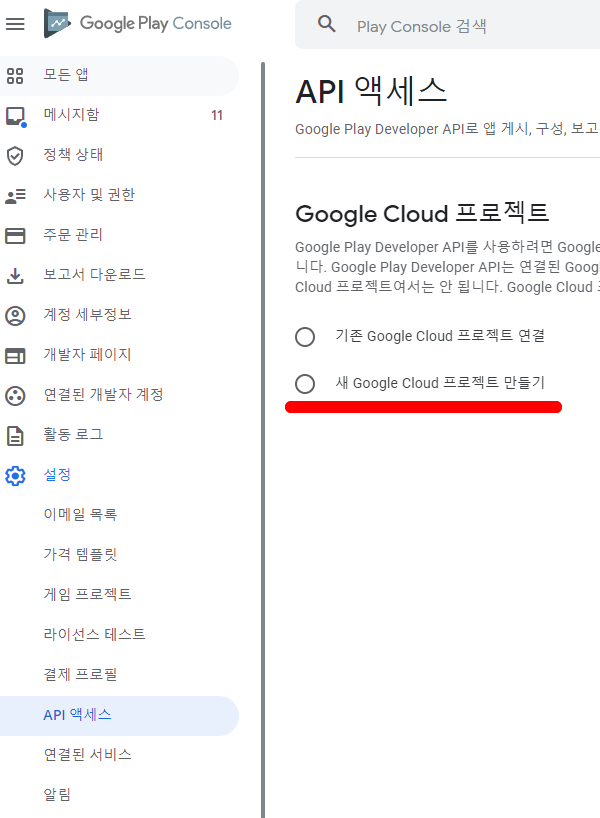
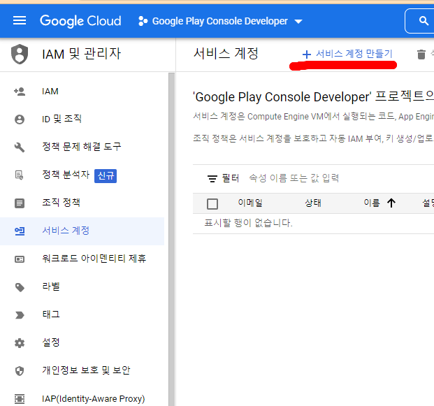
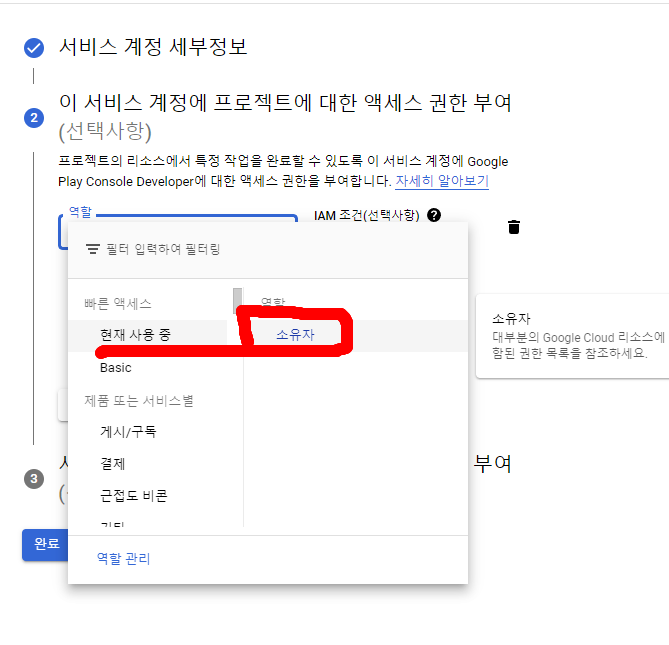
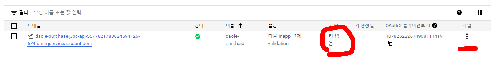
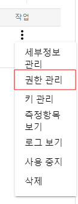
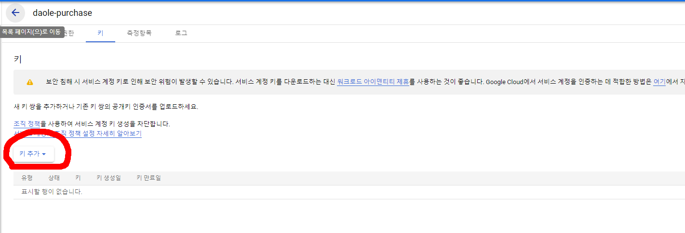
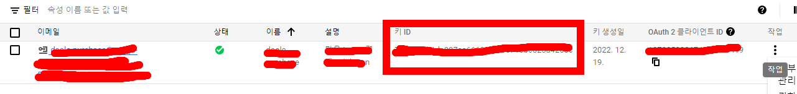

# Google Play Console API Access
- 구글플레이 콘솔을 API로 접근하는 방식이다.
- 구글 인앱 결제에서 유효성등을 체크는 것 등에 사용된다.
[구글 플레이 콘솔 > 설정 > API 액세스]

[구글클라우드플랫폼 > IAM 및 관리자 > 서비스 계정]

* 역활을 소유자로 설정하여야 한다.(매우 중요)

- 이후 아래와 같이 생성되는데 현재 여기서는 키값이 존재하지 않는다.
- 우리는 여기서 키를 만들어 줄 예정이다.

맨우측을 클릭하면 아래와 같이 나오는데 여기 [키 관리]를 클릭한다.
그림은 잘못되어있넹..ㅠ.ㅠ

키 추가를 하고 json 파일을 다운 받아 저장해 둔다. 이부분을 우리는 다른 web service에서 사용할 예정이다.

